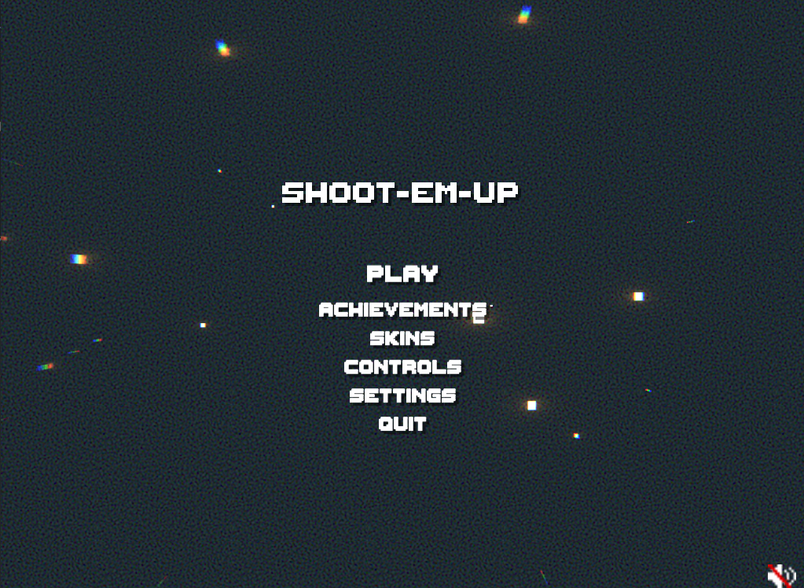

# Shoot-em-up

## About

Shoot-em-up is a 2D game made in Unity. The player controls a spaceship that flies through space. Other spaceships will try to attack the player, who will have to destroy them.

 

  

## Features

The game has:
- 3 enemy types
- achievements
- player skins
- highscore tracking
- 2 power-ups
- sound
- menu screen
- options menu
- pause menu

## How to play

### `Left arrow key - move left`
### `Right arrow key - move right`
### `Up arrow key - move up`
### `Down arrow key - move down`
### `Escape key - pause game`
### `Mouse click - shoot`
### `M - Mute Sound`

## Usage

The game can be played at [https://robertarotaritei.itch.io/shoot-em-up](https://robertarotaritei.itch.io/shoot-em-up).
